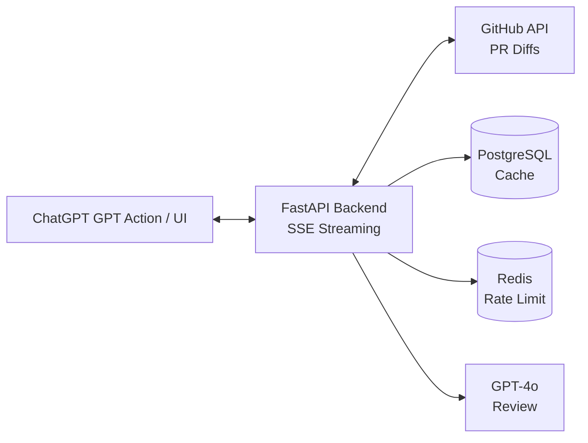

# CodeLens — AI-Powered Code Review GPT Action

<p align="center">
  
  
  
  
  90%25-brightgreen?style=for-the-badge" />
</p>

CodeLens is a production-grade GPT Action that lets ChatGPT users paste a GitHub PR URL or code snippet and receive structured, AI-powered code reviews with security flags, performance suggestions, and refactoring tips.

## Architecture



## Features

- **PR Review**: Paste any GitHub PR URL → get structured review with severity ratings
- **Snippet Review**: Paste raw code → get instant feedback on security, performance, style
- **Streaming**: Real-time SSE streaming of review results (token-by-token)
- **Caching**: Smart cache on `(repo, pr_number, head_sha)` — re-reviews return in <200ms
- **GPT Action**: Full OpenAPI 3.1 schema for ChatGPT GPT Store integration
- **Dashboard**: React frontend with annotated diff view, history, search/filter
- **Security**: Rate limiting, input sanitization, CORS, API key rotation
- **Observability**: Prometheus metrics, structured logging, Grafana dashboard

## Quick Start

### Prerequisites
- Docker & Docker Compose
- GitHub Personal Access Token
- OpenAI API Key

### Run Locally
```bash
# Clone
git clone https://github.com/your-org/codelens.git && cd codelens

# Configure
cp .env.example .env
# Edit .env with your GITHUB_TOKEN and OPENAI_API_KEY

# Launch
docker-compose up -d

# Backend: http://localhost:8000
# Frontend: http://localhost:5173
# API Docs: http://localhost:8000/docs
```

### Run Tests
```bash
# Backend
cd backend && pytest --cov=app --cov-report=term-missing -v

# Frontend
cd frontend && npm test
```

## Project Structure

```
codelens/
├── backend/
│   ├── app/
│   │   ├── main.py              # FastAPI app + OpenAPI config
│   │   ├── core/
│   │   │   ├── config.py        # Settings via pydantic-settings
│   │   │   ├── database.py      # Async SQLAlchemy + PostgreSQL
│   │   │   ├── redis.py         # Redis connection pool
│   │   │   └── security.py      # Rate limiting, sanitization
│   │   ├── models/
│   │   │   ├── schemas.py       # Pydantic request/response models
│   │   │   └── database.py      # SQLAlchemy ORM models
│   │   ├── routers/
│   │   │   ├── review.py        # /review-pr, /review-snippet
│   │   │   └── health.py        # /health, /metrics
│   │   └── services/
│   │       ├── github.py        # GitHub API integration
│   │       ├── reviewer.py      # GPT-4 review engine
│   │       ├── cache.py         # Review cache layer
│   │       └── streaming.py     # SSE streaming
│   ├── tests/                   # 25+ pytest tests
│   ├── requirements.txt
│   ├── Dockerfile
│   └── alembic.ini
├── frontend/
│   ├── src/
│   │   ├── App.tsx
│   │   ├── components/          # ReviewForm, DiffViewer, History
│   │   ├── hooks/               # useSSE, useReview
│   │   ├── pages/               # Dashboard, ReviewDetail
│   │   └── utils/               # API client, parsers
│   ├── package.json
│   ├── vite.config.ts
│   └── Dockerfile
├── docker/
│   └── docker-compose.yml
├── openapi.yaml                 # GPT Action schema
├── grafana/
│   └── dashboard.json           # Grafana dashboard config
├── .github/workflows/ci.yml     # CI/CD pipeline
└── .env.example
```

## GPT Action Setup

1. Go to [GPT Builder](https://chat.openai.com/gpts/editor)
2. Create new GPT → Actions → Import from URL
3. Enter: `https://your-domain.com/openapi.yaml`
4. Test: "Review this PR: https://github.com/owner/repo/pull/123"

## API Endpoints

| Method | Path | Description |
|--------|------|-------------|
| `POST` | `/review-pr` | Review a GitHub Pull Request |
| `POST` | `/review-snippet` | Review a code snippet |
| `GET`  | `/review-pr/stream` | SSE stream for PR review |
| `GET`  | `/health` | Health check |
| `GET`  | `/metrics` | Prometheus metrics |

## Security

- Rate limiting: 10 reviews/hr per IP (Redis + slowapi)
- Input validation: GitHub URL regex enforcement
- CORS whitelist for frontend origin
- API key rotation support for OpenAI
- SQL injection prevention via parameterized queries
- Request tracing with unique IDs

## Observability

- Structured JSON logging with trace IDs
- Prometheus metrics: `review_latency_seconds`, `review_count_total`, `cache_hit_ratio`
- Grafana dashboard included (`grafana/dashboard.json`)
- P50/P95/P99 latency tracking

## License

MIT
